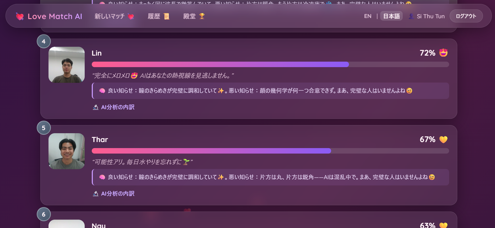
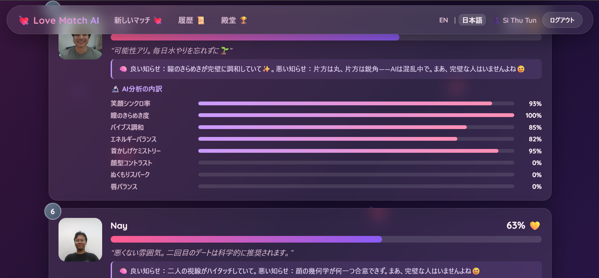
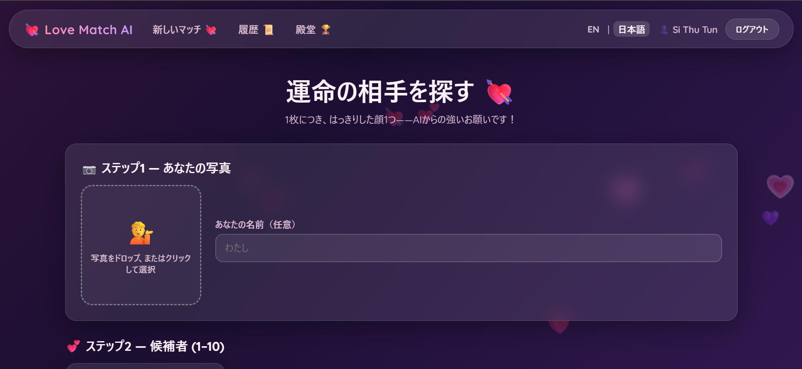

# 💘 Love Match AI

**A (deliberately) funny AI web app** — upload your photo and up to 10 candidate
photos, and the AI ranks who is most "compatible" with you, complete with
percentages, funny reasons, and a dramatic animated reveal.

> ⚠️ **This is a joke app.** Real romantic compatibility *cannot* be predicted
> from faces. But every number is produced by **genuine AI face analysis**
> (MediaPipe Face Mesh), which makes it both fun *and* explainable.

🌐 **English / 日本語** &nbsp;·&nbsp; 🔒 **Login required** &nbsp;·&nbsp; 💾 **100% offline**

📄 [日本語版 README はこちら → README.ja.md](README.ja.md)

School project for **先端クラウドシステム開発Ⅰ（問題2）** by **SI THU TUN / シートゥートゥン**.

---

## 📸 Screenshots

### The winner reveal 🎉


### Ranked results with funny AI reasons


### The AI analysis breakdown (real facial features)


### Upload page (your photo + up to 10 candidates)


### Hall of Fame 🏆


---

## 🚀 How to run

Requires **Python 3.10** (3.13 is too new for the AI libraries).

```bash
# 1. create a virtual environment
python -m venv venv

# 2. activate it
venv\Scripts\activate        # Windows
# source venv/bin/activate   # macOS / Linux

# 3. install dependencies
pip install -r love_match_ai/requirements.txt

# 4. run
python love_match_ai/app.py
```

Then open **http://127.0.0.1:5000** in a browser. The SQLite database is
created automatically on first run. No API keys or internet needed — all
fonts and JS libraries are self-hosted.

## 🕹️ How to use

1. **Sign up / log in** (required — there is no guest access).
2. **New Match** → upload *your* photo, then add **1–10 candidate** photos.
   One clear face per photo!
3. Press **Find My Match!** — the AI analyzes every face and reveals the
   ranked results with compatibility percentages, funny verdicts, and reasons.
4. Results save automatically: see **History** (view / rename / delete) and
   the **Hall of Fame** (your all-time top scores + stats).
5. Switch language anytime: **EN / 日本語** (top-right).

## 🧠 The AI model

- **Model:** MediaPipe **Face Mesh** — a facial-landmark regression model that
  predicts **478 3D landmarks** per face (plus MediaPipe Face Detection for the
  one-face-per-photo check). Runs locally on CPU, ~0.2 s/face.
- **Input:** the uploaded photos.
- **Predicts:** the landmark positions → the app derives **14 real features**
  per face (smile ratio, eye openness, eyebrow raise, face shape, lip fullness,
  head tilt, symmetry, brightness, warmth, saturation, sharpness…).
- **Compatibility score:** a deterministic *mix of both* formula — some
  components reward **similarity** (Smile Sync, Vibe Harmony…), others reward
  **difference** ("opposites attract": Face-Shape Contrast, Warmth Spark…).
  Same photos → same score, every time. Uploading your own photo as a candidate
  is detected and scores 100% ("twin flame" 🪞).
- This is a **different model and a different task** than a textbook image
  classifier (landmark regression + similarity, not classification).

## 🔒 Login-only features (beyond table CRUD)

- The **AI matchmaking analysis** itself
- **Match history** with rename/delete (CRUD on `matches` / `candidates`)
- **Hall of Fame** — personal all-time ranking + statistics

## 🗄️ Database (SQLite, custom schema)

| Table        | Contents                                                          |
|--------------|-------------------------------------------------------------------|
| `users`      | id, username, password_hash, created_at                           |
| `matches`    | id, user_id, title, my_name, my_photo, best_score, created_at     |
| `candidates` | id, match_id, name, photo, score, rank, band, verdicts, reasons, breakdown |

## 🧩 Tech stack

Flask · Flask-Login · Flask-SQLAlchemy (SQLite) · Flask-Babel (EN/JA) ·
Flask-WTF · MediaPipe · OpenCV · Pillow · vanilla JS + CSS animations.

## ✅ Testing

`e2e_test.py` runs 53 end-to-end checks (register → login → real AI match →
history/CRUD → Hall of Fame → both languages). All passing.

```bash
python e2e_test.py
```
